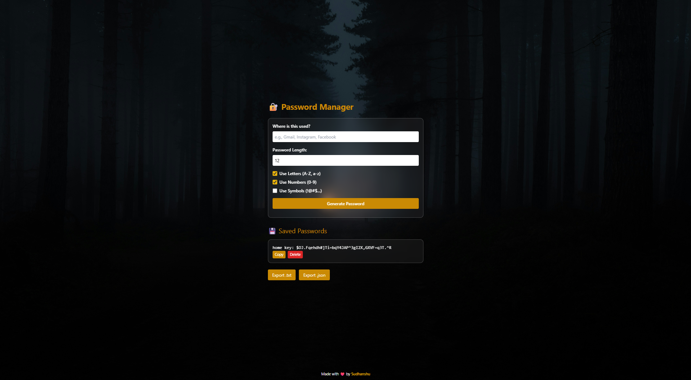

# 🔐 Password Manager

A simple, elegant, and secure password manager web app built with HTML, Tailwind CSS, and JavaScript.  
Generate strong passwords, save them with platform names, copy, delete, and export your saved passwords easily.

---

## 🚀 Live Demo

Try it out here: [https://sudhanshuverma1.github.io/Password-Manager/](https://sudhanshuverma1.github.io/Password-Manager/)

---

## Features

- Generate customizable passwords with options for:
  - Letters (A-Z, a-z)
  - Numbers (0-9)
  - Symbols (!@#$%^&*...)
- Save passwords with platform/service names (e.g., Gmail, Instagram)
- Copy passwords to clipboard with one click
- Delete saved passwords individually
- Export saved passwords as `.txt` or `.json` files
- Responsive, clean UI with dark theme and smooth interactions
- Passwords are saved securely in the browser's local storage

---

## Screenshot




---

## How to Use

1. Enter the platform or service where the password will be used (e.g., "Facebook").
2. Set your desired password length (default is 12).
3. Select character types you want to include in the password.
4. Click **Generate Password**.
5. You will see the generated password. Confirm if you want to save it.
6. Manage saved passwords below:
   - Copy password to clipboard
   - Delete unwanted passwords
   - Export all passwords anytime as text or JSON files

---

## Code Overview

- The app uses **localStorage** to save passwords locally on your device.
- Password generation logic supports letters, numbers, and symbols.
- Tailwind CSS is used for styling and responsive design.
- Clipboard API for copying passwords.
- Dynamic DOM manipulation to update the list of saved passwords.

---

## How to Run Locally

1. Clone the repo:

   ```bash
   git clone https://github.com/sudhanshuverma1/Password-Manager.git
